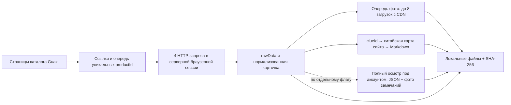

# Пробный массовый сборщик Guazi

Дата: 26.09.2026. Команда: `npm run pilot:guazi`.

Это отдельный сборщик файлов для проверки доступа, скорости и качества данных. Он не пишет в PostgreSQL, `public/data/cars.json`, рабочее хранилище фото или настройки импорта. Guazi остаётся отключённым источником рабочего каталога. Для пилота отбираются BEV модельного года 2020+ разрешённых марок; результат содержит исходные данные, чтобы дальнейший импорт мог применить актуальную политику каталога.

## Схема



1. Браузер открывает настоящие страницы каталога и читает ссылки на машины и следующую страницу из разметки. Очередь устраняет повторы по `productId`. Адреса страниц не перебираются наугад. В текущем пилоте обнаружение выполняется до чтения карточек, в пределах `--pages` на каждый источник списка.
2. Серверный режим `--transport session-http` читает HTML карточек четырьмя параллельными запросами `context.request` с cookies собственного браузерного профиля. Браузер открывает каталог и поддерживает сеанс; каждую карточку рендерить не нужно. Из встроенных React Flight JSON извлекается **`rawData` именно запрошенной машины**. Метод Che168 с `RSC: 1` не используется. Скрипты источника не исполняются нашим парсером. Ответы Playwright освобождаются после каждого запроса, чтобы их тела не копились на десятках тысяч машин. Прежний режим `--transport navigation` остаётся доступен и по умолчанию читает карточки в отдельных вкладках. Изображения, видео и шрифты при обычном чтении не загружаются браузером; для проверки доступа временно разрешаются.
3. В карточке сохраняются характеристики, все исходные адреса галереи, группы фото, FOB-цены по портам, сокращённый осмотр и исходная оценка. Нормализованная запись и исходный JSON находятся в отдельных файлах. Общий контрольный файл обновляется после каждых 25 обработанных карточек и в конце этапа. После остановки уже сохранённые исходные JSON позволяют восстановить промежуточную работу.
4. Китайский индекс загружается обычными HTTP-запросами: корневая карта → дочерние карты → адреса Markdown. Кеш действует сутки. Адрес берётся из карты; последние шесть цифр не вычисляются. В текущей выборке встречаются ID из 14 и 15 цифр: префикс перед шестизначным суффиксом соответствует `clueId`. Совпадение проверяется также по пробегу и месяцу регистрации. Несколько адресов для одного префикса, расхождения и неполная карта получают отдельные статусы.
5. Китайские описания и фото обрабатываются по четырём машинам одновременно. Загрузки фото проходят через общую очередь с отдельным ограничением параллельности. По умолчанию сохраняются первые **пять превью шириной до 600 px**, а адреса всей большой галереи остаются в карточке. Снимки поступают непосредственно с CDN, без cookies, паролей или браузерного проксирования.
6. Каждый снимок проверяется по HTTP-ответу, MIME, сигнатуре, размеру и SHA-256; запись выполняется через временный файл. Повторный запуск проверяет уже сохранённые файлы и загружает недостающие или повреждённые. Есть таймаут и предел 8 MiB на изображение. Неожиданные хосты и перенаправления отклоняются.
7. Проверка доступа, HTTP 403/429 останавливают новые браузерные задания. Уже полученные карточки можно обогатить и сохранить. Несколько запросов, начатых до остановки, могут завершиться. Без явного `--verify-checkbox` сборщик не проходит проверку; с ним допускается одна попытка известного checkbox на обращение к проверке, с общим часовым пределом (см. серверный запуск). Отсутствие ответа или китайского описания не означает продажу автомобиля.

## Запуск

Требуются зависимости проекта и установленный Chromium Playwright. Первый запуск открывает отдельный браузер с профилем `runtime/guazi-profile`. Cookies остаются в этом профиле, не попадают в результаты и Git. При необходимости вход выполняется пользователем в этом браузере. Уже авторизованный обычный Chrome автоматически не копируется.

Пять машин Tesla, пять локальных превью на машину:

```sh
npm run pilot:guazi
```

Проба скорости на 100 машинах с темпом 800 мс между переходами в каждой из четырёх вкладок:

```sh
npm run pilot:guazi -- --limit 100 --pages 6 --workers 4 --delay 800 --photo-workers 8 --out runtime/guazi-speed
```

Несколько марок можно задать повторением `--seed` с реальными адресами каталогов. Ограничение `--pages` относится к каждой марке и включает уже пройденные страницы при продолжении. `--limit` — целевое общее число принятых карточек в данной папке, включая сохранённые ранее. Если страницы закончились раньше, итог будет `partial`.

Большая галерея одной проверенной машины:

```sh
npm run pilot:guazi -- --url https://en.guazi.com/products/tesla-model-y-2024-00l-gray-60300km-at-2wd-5-seats-y2ud7mtru4.html --limit 1 --photos all --image large --out runtime/guazi-gallery
```

`large` означает адрес `imgUrl`, опубликованный источником, и не обещает камерный оригинал: размер зависит от машины. В `preview` используется `smallImgUrl`, а при его отсутствии — большая фотография с параметром уменьшения. Исходные параметры формата и качества сохраняются.

Повторение той же команды продолжает незавершённую работу. Увеличение `--limit`/`--pages` расширяет проход. Новая папка `--out` нужна для свежего снимка цен и состояния; обычное продолжение не перечитывает завершённые карточки. `--refresh-index` обновляет китайскую карту; `--skip-china` отключает китайское обогащение. `--photos 0` позволяет отдельно замерить карточки. После аварийного завершения оставшийся `.lock` удаляется только после проверки, что записанный в нём процесс действительно не работает.

Дополнительные режимы:

- `--headless`: необязателен, отдельно не гарантируется; ранний headless-эксперимент встречал EdgeOne.
- `--transport session-http`: проверенный быстрый серверный режим. Общий интервал `--request-interval 400` ограничивает старты запросов всей группы, дополнительно к паузе каждого потока. При 429/567/570/571/579 группа ждёт минимум 30 секунд или дольше по `Retry-After`, увеличивает интервал в 1,5 раза; одна браузерная навигация обновляет сеанс, затем запрос повторяется один раз. При сохранившейся защите проход останавливается с контрольной точкой.
- `--verify-checkbox`: одна попытка пройти именно проверенный виджет EdgeOne `#verifyCheckbox` в известном iframe на обращение страницы к проверке. В одной сессии разрешены повторные проверки: максимум 4 за скользящий час, минимум 60 секунд между попытками. Это разрешённое пользователем действие; оно включено в серверную команду. Другой вид проверки или неудача дают `SOURCE_BLOCKED`, без бесконечных попыток. Логин в аккаунт Guazi этим флагом не выполняется.
- `--cdp http://127.0.0.1:PORT`: существующий локальный браузер с уже включённым интерфейсом автоматизации. Сборщик создаёт свои вкладки и закрывает только их. Сам не включает этот интерфейс в пользовательском Chrome.
- `--capture-dir PATH`: обработка ранее сохранённых JSON `{url, observedAt, rawData}` без браузера; полезно для отделения получения карточек от фото и обогащения. Несовместим с `--seed`, `--url`, `--reports`.
- `--reports`: экспериментальное чтение страницы полного осмотра. Необходимо быть авторизованным в используемом профиле. Сохраняется только JSON ответа `/os/product/report/detail`, связанного с этим `productId`, без заголовков и cookies. Пока схема полного осмотра не проверена, статус **`captured_unvalidated`**, а не «осмотр собран». Фото дефектов и нормализованные пункты полного осмотра в эту версию не входят. При требовании входа — `needs_login`; публичный `reportDetailLite` никогда не подменяет полный отчёт.

## Запуск без личного компьютера

**Доступ на нашем сервере получен и проверен 26.09.2026.** Отдельная рабочая копия установлена в `/opt/abcars-guazi-pilot`; Node, Chromium и Xvfb уже были на сервере. Браузер использует конфигурацию существующего сборщика Che168: настоящий Linux user-agent, `en-US`, окно 1440×900, `--disable-blink-features=AutomationControlled`. Эта комбинация позволила пройти EdgeOne; один только факт прежней ошибки не доказывал блокировку IP.

Запуск на сервере:

```sh
cd /opt/abcars-guazi-pilot
bash deploy/run-guazi-pilot.sh --limit 100 --pages 6 --out runtime/my-run
```

Команда включает Xvfb, постоянный профиль `runtime/guazi-profile`, `session-http`, разрешённую попытку проверки, четыре потока с паузой 800 мс, общий интервал 400 мс и восемь загрузок фото. Блокировка `flock` не даёт двум запускам одновременно использовать профиль. Профиль, cookies и файлы остаются на сервере; браузер пользователя, прокси и дополнительный аккаунт не требуются. Работа после остановки и нового запуска браузера проверена. Чистый профиль тоже собрал 5 карточек и 25 фото без ручного действия.

Первый короткий серверный прогон без общего интервала: **100 карточек за 27,618 с; весь проход с китайским индексом, описаниями и 500/500 фото — 59,265 с**. Получено 2 821 адресов галереи, скачано 13 917 478 байт, ошибок карточек/фото нет. Китайские описания: 87 совпадений, 10 не найдены, 3 требуют проверки; поэтому общий статус `partial`. Следующая длинная проба без общего интервала встретила HTTP 567 после 160 принятых машин. Это не устойчивый темп; после неё добавлены общее ограничение частоты и обработка перехвата. Детальный протокол: `../research/competitors/2026-09-26-guazi-independent-probe/server/README.md`.

**Длинная проверка с общим интервалом завершена:** продолжение прочитало 490 карточек за 196,6 с (2,49/с); 340 из них дополнительно прошли отбор BEV 2020+. Вместе с первыми 160 сохранено **500 машин (426 Tesla, 74 BYD), 13 853 URL галерей и 2 500/2 500 файлов фото**, 68,7 МБ снимков. В продолжении не было ошибок карточек/фото и перехватов защиты; 800 прежних файлов использованы после проверки, 1 700 скачаны заново. Все 2 500 снимков затем отдельно проверены по размеру и SHA-256. Статус `partial` отражает девять расхождений китайских описаний. Продолжение заняло 350,18 с; это не время получения всех 500 с нуля.

Фоновый запуск после закрытия SSH также проверен: **10 карточек и 50 новых фото за 9,12 с**, без китайского этапа. Для такого запуска:

```sh
nohup bash deploy/run-guazi-pilot.sh --limit 100 --pages 6 --out runtime/my-run > runtime/my-run.log 2>&1 < /dev/null &
```

Размер пилотной выборки 500 машин со всеми JSON и индексом — около 135 МБ. На сервере осталось около 9,6 GiB; для 50 тысяч при сходной структуре потребуется примерно 12–14 ГБ без больших фото и резерва. До такого объёма нужно расширить хранилище; контроль минимального свободного места в файловом пилоте пока не реализован.

Срок действия cookies не гарантирует доступ до этой даты: источник может изменить проверку раньше. Длительная суточная устойчивость ещё не доказана. Серверная копия — самостоятельный файловый пилот; служба/расписание не включались, рабочий каталог и база не менялись. Полные осмотры подключены отдельным этапом через `--reports --auth-state`; см. дополнение ниже.

## Результаты на диске

```text
runtime/guazi-pilot/
  checkpoint.json         очередь, страницы, пропуски, принятые ID
  summary.json            темп, длительности, счётчики, ошибки, конфликты
  raw/<productId>.json    исходная публичная карточка с URL и временем чтения
  cards/<productId>.json  нормализованные данные и локальные адреса снимков
  china-index.json        полный индекс китайских описаний и его ошибки
  china/<productId>.md    исходное китайское описание
  photos/<productId>/     проверенные локальные снимки
  reports/<productId>.json исходные ответы полного осмотра
  inspection/photos/<productId>/ фото замечаний осмотра
  backups/<timestamp>/     предыдущие карточки перед повторной нормализацией
```

`summary.json` содержит отдельные времена обнаружения, чтения карточек и обогащения, фактическое количество **новых** карточек, сохранённых/повторно использованных фото и общий объём снимков. `browserAccess` отражает число запросов, обновлений сеанса и попыток проверки, без значений cookies. Код завершения: `0` — выбранные этапы выполнены; `2` — проверка доступа; `3` — частичный результат; `1` — ошибка запуска/файлов. Сбор с `--reports` становится частичным при непроверенном отчёте или ошибках загрузки его фото.

## Правила данных

- FOB в USD и китайская цена в CNY — разные поля и основания цены. Они не передаются в рабочий калькулятор автоматически.
- Экспортная оценка A и китайская B сохраняются обеими с `conflicts`; подмена одной другой запрещена.
- `observedAt` — время нашего чтения. `generatedAt` — время генерации китайской страницы. Ни одно не является датой публикации объявления.
- Скрытый VIN сохраняется скрытым. Неизвестное число переоформлений остаётся `null`.
- `availability.status = unverified`: присутствие страницы не подтверждает наличие машины. Отсутствие в текущем проходе не переводит её в проданные.
- Снимки берутся из галереи конкретного `rawData`, а не из всех `` страницы: последние включают рекомендации других машин.

## Масштабирование и границы пилота

Для сравнения в `IMPORTER.md` у Che168 записан результат около 100 карточек за 40 секунд. Это темп карточек, который нельзя напрямую сравнивать с полным проходом Guazi, включающим китайские описания и скачивание фото. У Guazi нужен отдельный замер всех трёх этапов.

### Локальный замер 26.09.2026

Прогон `runtime/guazi-pilot-speed-20260926`, четыре вкладки, пауза 800 мс на вкладку, до восьми одновременных загрузок снимков:

| Этап / результат | Значение |
|---|---:|
| Обнаружение на шести страницах Tesla | 115 уникальных ID за 7,02 с |
| Принятые карточки | **100 за 32,87 с**, 3,04 карточки/с |
| Исходные адреса большой галереи | 2 709 |
| Китайские описания + локальные фото | 51,54 с |
| Полный проход, включая построение китайского индекса | **91,43 с** |
| Фото 600 px, фактически сохранённые | **500/500**, 13 195 180 байт |
| Китайское описание совпало по проверяемым данным | 85 |
| Китайское описание требует проверки | 2 |
| Китайский адрес не найден в текущей карте | 13 |
| Конфликт экспортной/китайской оценки | 26 |
| Ошибки чтения карточек и загрузки снимков | 0 |

Статус прогона — `partial` из-за двух расхождений китайских данных, а не из-за недокачанных карточек/фото. Полные осмотры в этом замере не запрашивались. В исследовательской папке сохранён неизменяемый результат `pilot/first-run-summary.json`; повторный запуск обновляет рабочий `summary.json`.

В обоих расхождениях пробег отличается на 1 км; возможное округление не исправляется автоматически. Повторный запуск использовал все 500 фото после проверки хешей, не читая карточки заново. Дополнительная проверка `--photos all --image large --reports` сохранила **27/27 больших снимков**, 5 786 078 байт; страница полного осмотра потребовала входа, в карточке записано `needs_login`. Этот профиль браузера не содержит вход из обычного Chrome пользователя.

**Скорость карточек на этой выборке сопоставима с замером Che168.** Линейный пересчёт полного прохода даёт примерно 2,5 часа на 10 000 машин или 12,7 часа на 50 000, но это только оценка по короткому тесту, не проверенная пропускная способность. Разные марки, срок жизни сеанса, ограничения источника и полные отчёты могут существенно её изменить.

Пилот поддерживает ограниченные пулы чтения и скачиваний, устранение повторов, контрольные точки и продолжение. До постоянного прохода на десятки тысяч машин остаются: длительная проверка сеанса, полнота обхода по маркам/моделям, обновление цены/наличия, долговременная проверка входа для полного осмотра. Следующая оптимизация при необходимости — одновременная работа обнаружения, карточек и обогащения через постоянную очередь; в этой версии три этапа следуют друг за другом, внутри этапов есть параллельность.

Проверки кода:

```sh
node --test tests/guazi-pilot.test.mjs
```

Исследования и исходные ограничения: `../research/competitors/2026-09-26-guazi-independent-probe/`, особенно `bulk/README.md` и `file-comparison/README.md`.

## Обогащение и полный осмотр — 26.09.2026

Карточка `schemaVersion: 2` сохраняет полную английскую таблицу в общей с Che168 схеме `technicalSpecs`, а отдельные числовые параметры — в `catalogFields`. Русские названия выдаёт общий `translateTechnicalSpecs`: исходные числа и неизвестные значения сохраняются. Привод нормализуется теми же правилами, что Che168. Мощность в кВт не выдаётся за л.с.: пересчёт в метрические PS явно записан в `horsepowerDerivation`. Запас хода имеет стандарт CLTC; нулевой клиренс не превращается в достоверное измерение.

Китайские многострочные `description` и `highlights` теперь извлекаются целиком. `china.condition` содержит исходный текст, балл внешнего вида, число страховых обращений, переоформлений, фрагменты о состоянии и русскую сводку числовых фактов. Свободный китайский текст о ремонте пока остаётся оригиналом со статусом `repair_text_pending`: это **не полный русский перевод**. Девять несопоставленных описаний сохраняются с `needs_review` и не должны автоматически попадать в сведения о машине. Оценки китайской и экспортной площадок не подменяют друг друга.

Для обновления сохранённых карточек без сетевых запросов:

```sh
node scripts/guazi-pilot-reprocess.mjs --out runtime/server-500
```

Команда проверяет все входные записи, блокирует каталог тем же `.lock`, сохраняет предыдущие карточки в `backups/<timestamp>/`, затем атомарно переписывает их. Сохраняются время исходного наблюдения, фото с хешами и уже полученные полные осмотры. Код не обращается к рабочей базе.

### Доступ к отчётам

Пользователь разрешил перенос сеанса **только en.guazi.com** из своего Chrome на сервер 5.23.48.128. Пароль не переносился. В серверном пилоте файл `runtime/guazi-session.json` имеет права `600` и содержит только cookies этого сайта; прочие сайты и рекламные cookies исключены. Файл доступа и значения cookies запрещено включать в Git, исследовательские документы, вывод команд или результаты сбора. Профиль и файл доступа должны оставаться в каталоге с правами `700`.

```sh
bash deploy/run-guazi-pilot.sh --out runtime/server-500 --limit 500 \
  --reports --auth-state runtime/guazi-session.json --skip-china
```

После открытия одной карточки серверным браузером отчёты идут обычными запросами с общим ограничением частоты на `/os/product/report/detail?language=en&productId=...`. Повторный запуск пропускает проверенные отчёты и проверяет сохранённые фото. Отказ во входе или блокировка сохраняются явным статусом; истечение сеанса не является отсутствием осмотра. Автоматический новый вход в аккаунт не реализован.

Проверка отчёта включает успешный ответ API, фактический запрос конкретного `productId`, совпадение `taskId` и скрытого VIN с карточкой. В старых отчётах `taskId=0`: дополнительно обязательны точное совпадение основной фотографии и названия автомобиля. Неизвестная схема или несоответствие не принимаются за корректный отчёт.

`inspection.full` содержит все группы и пункты, исходные результаты и координаты отметок на фото, оценку, ссылки на все снимки осмотра и видео. `source_normal/source_abnormal` передают классификацию Guazi; это не наше заключение о безопасности автомобиля. Исходные признаки аварии/воды/пожара сохранены без догадки о семантике флагов.

Файлы фотографий **пунктов с замечаниями** скачиваются с CDN без передачи cookies, в выданном источником размере (часто 750×500). Они лежат в `inspection/photos/`, отдельно от галереи продаж, с SHA-256 и проверкой MIME/сигнатуры. Все остальные адреса фото осмотра сохранены, но их файлы по умолчанию не скачиваются. Видео сохраняется ссылками.

Проверки: `node --test tests/guazi-pilot.test.mjs tests/guazi-enrichment.test.mjs tests/che168-russian-specs.test.mjs tests/che168-english-import.test.mjs tests/vehicle-spec-integrity.test.mjs`.

Итог серверной проверки: **500/500 полных отчётов**, 133 440 пунктов, 5 346 пунктов с замечаниями; **4 547 фото замечаний** (133 013 201 байт) сохранены и проверены по SHA-256 вместе с прежними 2 500 фото галереи. Последний проход: 345,492 с, 496 новых отчётов + 4 ранее проверенных, без блокировок. Это время этапа осмотров и фото, не сбора карточек с нуля. Исследование и неизменяемые счётчики: `../research/competitors/2026-09-26-guazi-independent-probe/enrichment/`.
